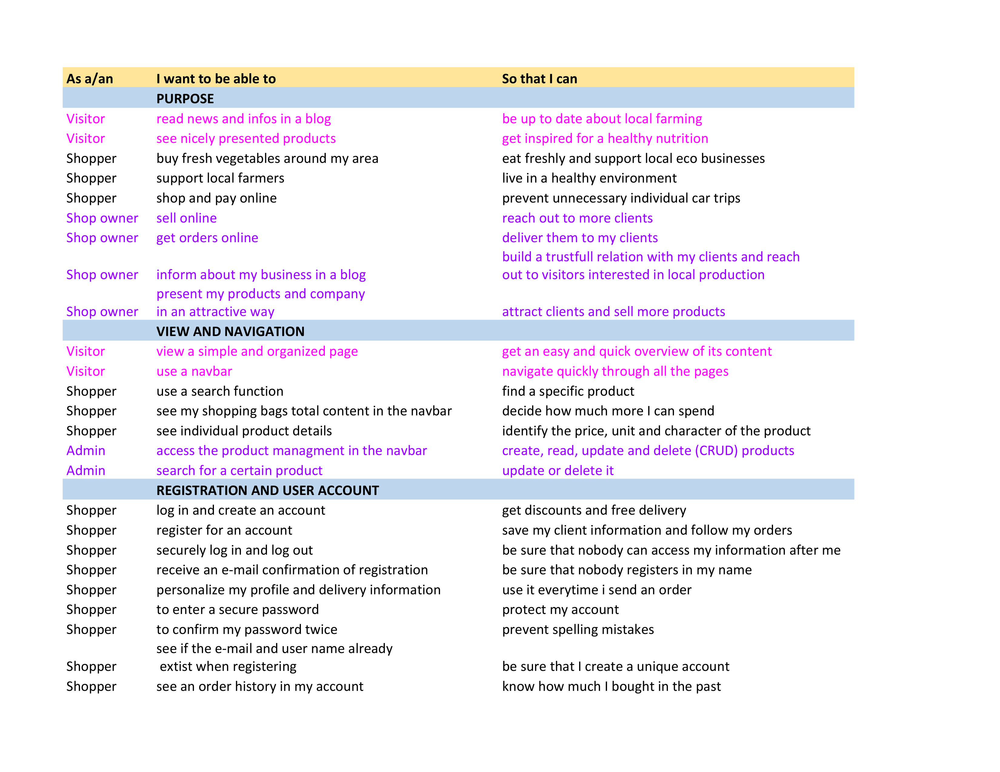
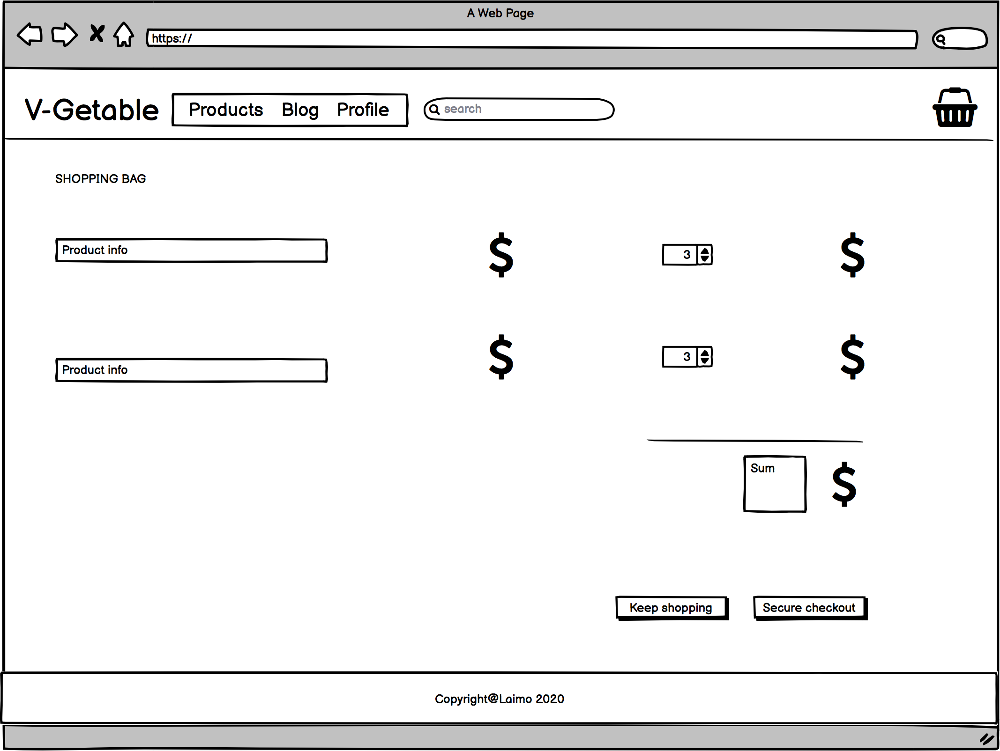
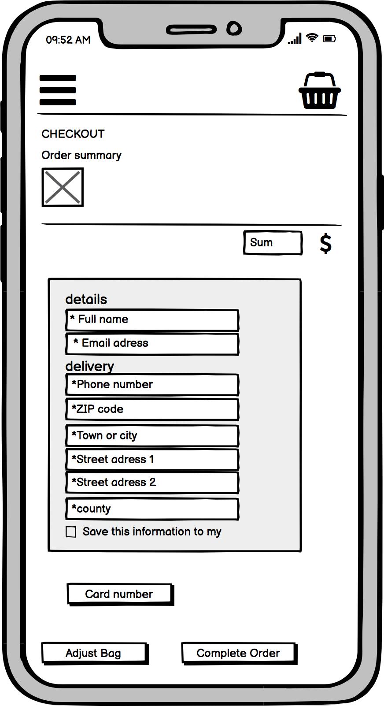
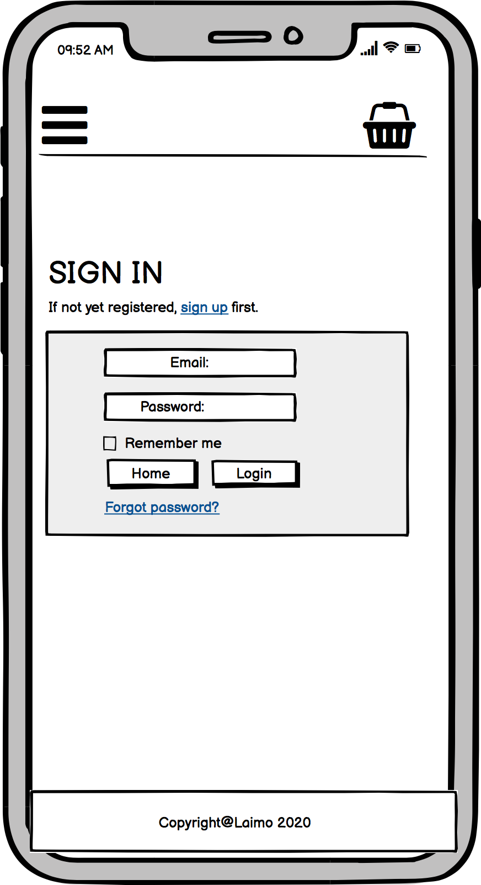

# Milestone Project 4: V-Getable

The purpose of the project “V-getable” is to build a full-stack site based around business logic used to control a centrally-owned dataset.

The site includes an online store connecting a group of farms and gardeners selling local products, such as vegetables, fruit, eggs, milk and bread with clients interested in supporting local business. Clients can browse through products, make a selection, shop and pay their order. As a client with a profile, the page offers an option to get free delivery and discounts. Admin-options allow the shop-owner to add and edit products and keep track on the clients orders as well as interact with and inform clients on a blog.

## UX

The online-shop “V-getable” offers a great option for everyone that cares about healthy, ecological and locally produced products in his nutrition.

A variety of products, nicely presented, attracts visitors on the page to make their choice on how much and what they like and save products in their shopping basket. Sending the order and paying directly by credit card makes it easy to receive fresh products all the way to home while preventing singular car-trips to the countryside.

The shop owner profits from various and easy-to-handle options when it comes to setting up new products, prices and keep track on incoming orders and requests. The blog, included, in the page, allows the company to post news and background information about their way of farming and production of their products. This raises trust for clients interested where their food comes from and how it is produced. Clients even have the option to comment and interact thereby with the farmers.

### User stories

###  Wireframe 
For the creation of my wireframes I used the Balsamiqu program (see “technologies used"). Throughout the development of the webpage the wireframes were very helpful for me to reach the final design.

I have created mobile, tablet, desktop and tablet wireframes.

1- Desktop Wireframes
  - 
  - 
  - 
  - 
  - 
  - 
  - 
  - 

2- Mobile Wireframes
  - 
  - 
  - 
  - 
  - 
  - 
  - 
  - 

3- Tablet Wireframes
  - 
  - 
  - 
  - 
  - 
  - 
  - 
  - 

## Sections and features 

### Home-page
   - Navbar  
   The navbar appears in all sections and helps the user to navigate through them with links to the "Home-page" (represented by the logo) "Products", "Blog" and "Profile"
   In mobile devices and tablet the navbar transforms to a drop-down menu. The shopping bag item remains visible.
     - Search function  
        To find specific products in the shop
     - Shopping basket  
        Gives an overview of the total amount and content in the users shopping bag

   
    - Background information 
    A short text providing background information on the company.
        - Go to our shop 
        Allows the user to reach the product page
        - Go to our blog 
        Allows the user to reach the blog

### Products

- Product overview 
Overview of all products in the shop, represented by pictures, name, price and unit. By klicking on a product the user reaches "Product information"

- Product information 
A detailed description of the product. The user is abled to chose the quantity he/she wnats to add to the shopping bag. By klicking "add to bag" the product is added to the shopping bag. A toast appears. By klicking "keep shopping" the user can return to the product overview.

### Shopping bag

- Overview  
Shows information on all products in the shopping bag, subtotal, bag total and grand total. If the user reaches the required amount for free deilvery fee is automatically reduced. 
By klicking "keep shopping" the user returns to product overview. "Secure checkout" leads to "Check out".

- Check out  
The user is demanded to fill in a form with delivery details as well as credit card information. Pre-filled information can be used. A order summary enables the user to see the order. 
By klicking "Adjust bag" the user returns to his shopping bag. A red message with the grand total appears, reminding that the user will be charged by clicking "Complete order". After completing the order a toast appears.

- Payment  
The payment is secured by "stripe.com".

### Blog 
Shows history of all posts, though only the four latest per page (pagenation).
- Post  
A user can read posts, added by the admin. Klicking "read more" the user reaches the full text of a specific post and the option to comment.

- Comments  
The total number of comments on a post is counted and visible for the user.
Users can interactively leave comments through a form and read previous comments. Comments need to be approved by the admin before getting visible to public. 

### User profile

- Register 
The user is asked to fill in a form, providing E-mail, Username and password. If the user is already signed up, a linke enables him/her to reach the log in page.
Different toasts and an obligatory e-mail confirmation ensure a secure registration.

- Sign in  
The user can sign in with username or e-mail and password. He/She can svae the information for easy log-in. 

- Account  
The user can fill in his/her default delivery information and see the order history. Klicking on an order shows up detailed order information. 

### Admin profile

- Product management  
Enables the admin to add, edit and delete products. In the product overview the logged-in admin has an option to edit or delete existing products.

### Admin panel

- Accounts 
The admin can change the admin e-mail. In an overview the admin can read, and delete all registered e-mail.
- Blog  
The admin can read, create, edit and delete posts. When creating a post there is an option to save as a draft or publish.
Under "Comments" the admin can approve or delete selected comments.
- Checkout/Orders  
The admin can see an overview, edit and delete orders.
- Products  
The admin can add or delete categories to structure the products.
There are three categories that the admin can edit and delete.
Under "Products" the admin can see an overview, edit, create and delete products and attach photos to the product information.

### Features Left to Implement
An annualie subscription with fixed places to collect products

### Database relations

# Technologies Used

### 1. [HTML](https://html.com/)

For the basic structure of the project

### 2. [CSS](http://css.com/)

For the styling and design of the webpage

### 3. [JavaScript](https://www.javascript.com/) 

 Add dynamic and interactive elements to websites 

### 4.  [Bootstrap](https://getbootstrap.com/)

Quick and responsive form and method to implement.

### 5. [GitHub](https://github.com/)

Platform to publish the webpage and interact with clients and the coder community

### 6. [Gitpod](https://www.gitpod.io/)

A coding editor with an adapted and easy coding environment

### 7. [GIT](https://git-scm.com/)

For version control. This project where duplicated as gitpod was down for few days and the first project never worked after the gitpod have fixed the issues 

### 8. [Django](https://www.djangoproject.com/)

A web framework  for Python
### 9. [Font Awesome](https://fontawesome.com/6?next=%2F)

As a resource of icons to style my page
### 10. [Alluath](https://django-allauth.readthedocs.io/en/latest/installation.html)
a pckage in fjango to Secure registration 

### 11. [Chrome DevTools](https://developers.google.com/web/tools/chrome-devtools)

For live editing options while coding the page
### 12. [Balsamiq](https://balsamiq.com/)

To create wireframes
### 13. [Heroku](https://dashboard.heroku.com/apps)
Storing my app.
### 14. [Pyhton](https://www.python.org/)
Backend programmering language.
### 15. [AWS](https://aws.amazon.com/free/?all-free-tier.sort-by=item.additionalFields.SortRank&all-free-tier.sort-order=asc&awsf.Free%20Tier%20Types=*all&awsf.Free%20Tier%20Categories=categories%23compute&trk=ps_a134p000004f2onAAA&trkCampaign=acq_paid_search_brand&sc_channel=PS&sc_campaign=acquisition_EMEA&sc_publisher=Google&sc_category=Cloud%20Computing&sc_country=EMEA&sc_geo=EMEA&sc_outcome=acq&sc_detail=aws%20server&sc_content=Cloud%20Server_e&sc_matchtype=e&sc_segment=467752182153&sc_medium=ACQ-P|PS-GO|Brand|Desktop|SU|Cloud%20Computing|Solution|EMEA|EN|Text|xx|EU&s_kwcid=AL!4422!3!467752182153!e!!g!!aws%20server&ef_id=EAIaIQobChMIwqz_8Zfg7QIVAWYYCh3cBA1OEAAYASAAEgIu3fD_BwE:G:s&s_kwcid=AL!4422!3!467752182153!e!!g!!aws%20server)
To store my css files & media as images.
### 16 [Stripe](https://stripe.com/en-se?utm_campaign=paid_brand-SE_en_Search_Brand_Stripe-1436985502&utm_medium=cpc&utm_source=google&ad_content=275927467139&utm_term=stripe&utm_matchtype=e&utm_adposition=&utm_device=c&gclid=CjwKCAiA57D_BRAZEiwAZcfCxZ9ZTxZfWH88HEC3FTFdbrq5fAXY0RntFn8qP9u3jWiyBYI8aq7e0RoCsNEQAvD_BwE)
To secure online payment
### 13. [Goggle-Font](https://fonts.google.com/)
Text font 

## Testing 

### Testing and review of the webpage

1. I have tested the webpage myself in the following browsers and devices:
- Google Chrome + ggogle dev tool 
- Safari
- Iphone XR
- MacBook Air

2. I have sent the webpage to family and friends who tested the page and responsiveness on following browser and devices:
- Iphone 12
- iPad
- iPhone SE

### Validation of the code: I have used the follwoing tech to test my code:
- [W3C/HTML](https://validator.w3.org/)
to check my  HTML code.
- [W3C/CSS](https://jigsaw.w3.org/css-validator/)
to check my CSS code.
- [Jshint](https://jshint.com/)
to check my JS code.
- [PEP8](http://pep8online.com/)
to check my python code

### Manual Testing: